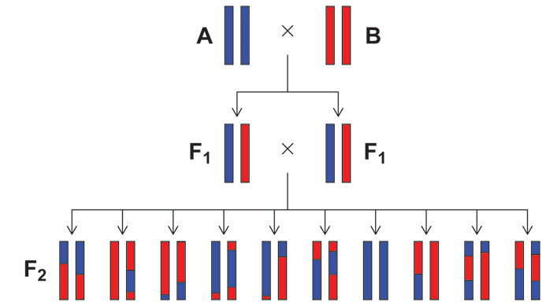

## Multi-marker and linear mixed model approaches to mapping disease and quantitative trait loci: Module for 2014 Kyoto Course on Bioinformatics

Second Kyoto Course and Symposium on Bioinformatics for
Next-generation Sequencing with Applications in Human Genetics 
Center for Genomic Medicine 
Kyoto University 
March 10-12, 2014

###License

Copyright (C) 2014 [Peter Carbonetto](http://www.cs.ubc.ca/spider/pcarbo) 
Dept. of Human Genetics 
University of Chicago

This program is free software: you can redistribute it and/or modify
it under the terms of the
[GNU General Public License](http://www.gnu.org/licenses/gpl.html) as
published by the Free Software Foundation, either version 3 of the
License, or (at your option) any later version.

This program is distributed in the hope that it will be useful, but
**without any warranty**; without even the implied warranty of
**merchantability** or **fitness for a particular purpose**. See
[LICENSE](LICENSE) for more details.

###Introduction

The goal of this module is to explore linear mixed models (LMMs) and
multi-marker models for identifying genetic variants correlated with a
quantitative trait. LMMs and multi-marker mapping methods have been
used to map the genetic loci that contribute to risk of complex human
diseases, but here we will illustrate these methods for mapping
quantitative trait loci (QTLs) in mice instead. Specifically, we will
be working with data from advanced intercrosses of (inbred) lab
strains. In this module, our goal is to develop a better appreciation
for the features of LMMs and multi-marker methods;when and why these
approaches might be useful; and how to interpret the results.

The focus is on cultivating a better understanding of these methods
by example; we will not explore the mathematical foundations of
these methods, at least not in detail.

An advanced intercross population has several features that make it
well-suited for exploring data analysis procedures for genetic
association studies: (1) the patterns of linkage disequilibrium are
more predictable than in humans; (2) all the alleles are common; (3)
relative to humans, the environment is better controlled, and so
environmental conditions are expected to play a smaller role in
complex traits; and (4) we can trace each allele to one of the two
inbred founders. As a result of (4), we can determine whether the
alleles from any two individuals at a given locus are
identical-by-descent (IBD); in human studies, this is not possible
(except under certain circumstances).

**Illustration of the transmission of alleles in an F2 intercross.**
Source: *Broman and Sen, A Guide to QTL Mapping with R/qtl, 2009.*

In a traditional intercross, two inbred strains are crossed to obtain
the first generation (F1) of mice.  In our case, the inbred founders
are the [LG/J](http://jaxmice.jax.org/strain/000675.html) and
[SM/J](http://jaxmice.jax.org/strain/000687.html) inbred strains
obtained from Jackson Laboratories. Since the mother and father have
identical chromosomes, each F1 mouse is genetically identical (see the
figure). If we denote the LG/J and SM/J alleles by A and B, all F1
mice have genotype AB (for loci on autosomal chromosomes).

The next generation (F2) is obtained by randomly crossing the F1
mice. The F2 mice have three possible genotypes on autosomal
chromosomes, AA, AB and BB. This random mating ("outbreeding") is
repeated in subsequent generations to produce the advanced
intercross. In the data set we will examine for this module, we have
phenotype and genotype data from F2 mice, and in mice from the 34th
generation of the advanced intercross. Understanding the features of
an advanced intercross is not a central objective of this module, but
it is useful to make some observations about this as we progress.

The quantitative traits we will analyze were measured as part of study
of anxiety-type behaviour in mice. In the "conditioned fear" paradigm
to assess anxiety, the amount of "freezing" is measured over three
separate days after exposure to paired tones (the conditioned
stimulus) and shocks (the unconditioned stimulus). The goal of this
study was to advance our understanding of the genes underlying anxiety
disorders. The fear conditioning traits are expected to have a highly
complex genetic basis; any individual locus is expected to explain
only a small proportion of the total variation in these traits.

We have also recorded coat colour (LG/J mice are albino, SM/J mice are
agouti). Coat colour is a major confounder for the fear conditioning
traits because albino mice are not tracked as well with the video
equipment. (If you aren't convinced, you will see that the QTL mapping
reveals a strong association near a known pigmentation gene.) This
also provides an opportunity to attempt to map QTLs for a Mendelian
trait.

###Objectives

1. Learn how to apply LMMs methods to a genetic association study, and
discover some of the features of LMMs by example.

2. Learn how to apply multi-marker methods to a genetic association
study, learn how and discover some the features of multi-marker methods by
example.

3. Work with a data set generated from a mouse advanced intercross
line.

4. Learn how to use the R, QTLRel and varbvs packages for R.

5. Get some exposure to [github](http://github.com), a fantastic tool
for sharing data and source code, and collaborating on projects (and
creating teaching modules for workshops!).

###Prerequisites

1. You are comfortable using the R interface, executing R scripts,
manipulating variables in R, working with functions in R, and making
small modifications to R scripts.

2. You are familiar, or at least have exposure to, the basic notions
and standard terminology used to describe the statistical analysis of
genetic association studies.

3. You are familiar with core concepts in genetics and genetic analysis.

###Getting started

To work on the exercises in this module, you will first need to
complete these steps.

First, make sure you have a recent version of
[R](http://www.r-project.org) installed on your computer.

Next, download and install R packages
[qtl](http://github.com/kbroman/qtl) and
[QTLRel](http://github.com/pcarbo/QTLRel) using the
**install.packages** function in R.

We will also use the [varbvs](http://github.com/pcarbo/varbvs)
package. You can also install this package using **install.packages**,
but I recommend getting the most up-to-date version from
github. Follow the "Quick start for R" instructions to install this
package from the source code.

Finally, you will need to download the source code for this
module. The simplest way to do this is to [download this repository
as a ZIP archive](http://github.com/pcarbo/kyoto/archive/master.zip).
Alternatively, if you have a github account, you can
[fork](http://help.github.com/articles/fork-a-repo) the repository,
and clone it on your local machine.

Once you have completed these steps, you are ready to move on to the
exercises below.

###Overview of data files

Here is a brief summary of the files in the [data](data) directory:

+ [pheno.csv](data/pheno.csv) Phenotype data from 3-day fear
conditioning study for mice from the F2 and F34 generations of the
LG/J x SM/J advanced intercross line. Includes other information such
as gender, age and coat colour.

+ [geno.csv](data/geno.csv) Genotypes at 4608 SNPs for mice from 
F2 and F34 crosses.

+ [map.csv](data/map.csv) Information about the 4608 SNPs, including
genetic distances and chromosomal positions.

###Overview of R source code files

Here is a brief summary of the files in the [R](R) directory:

+ [read.data.R](R/read.data.R) Defines several functions for
reading experimental cross data from files in comma-delimited ("csv")
format.

+ [data.manip.R](R/data.manip.R) Functions for manipulating the
experimental cross data, and for converting the data into the
various formats used by R/qtl and QTLRel.

+ [mapping.tools.R](R/mapping.tools.R) Functions for analyzing the
QTL experiment data, and for computing marker-based estimates of
pairwise relatedness.

+ [mvnpermute.R](R/mvnpermute.R) Function written by Mark Abney to
execute a permutation-based test with multivariate normally
distributed data.

+ [misc.R](R/misc.R) Various utility functions that do not fit in the
other files.

+ [map.qtls.R](R/map.qtls.R) This script maps QTLs across the genome
in a single filial generation of an advanced intercross line (AIL),
using two different "single-marker" methods: a method that ignores
unequal relatedness in the mouse population ("scanone" from the R/qtl
library); and a method that attempts to correct for this ("scanOne"
from the QTLRel library).

+ [multi.map.qtls.R](R/multi.map.qtls.R) This script maps QTLs across
the genome by simultaneously considering all markers as candidate
predictors for the trait ("multi-marker mapping"). This script uses
the same data set as map.qtls.R.

###Part A

In Part A of this module, we investigate the linear mixed model (LMM)
for mapping QTLs in the advanced intercross.

Some of the more involved questions are optional; please focus on the
non-optional questions, so that we have time to move on to Part
B,. Later, if there is time we can return to the more difficult
questions. For all of Part A, we will work with the R script
[map.qtls.R](R/map.qtls.R).

**Important note:** Some of the computations take a long time to
complete (as long as 15-20 minutes, depending on your computer). For
this reason, I recommend working in teams of 3-4 so that each member
of the team can run the script with different settings, and then you
can compare the results you generated with your team members.

####QTLs with and without a polygenic effect

Here we compare genome-wide scans for a polygenic trait in the F2 and
F34 cohorts using (1) a linear regression model that includes the
"polygenic effect" (intended to capture population structure), and (2)
a linear regression model without the polygenic effect.

We start by assessing support for SNPs that explain variance in a
behavioural trait; specifically, freezing after exposure to tones
("freezing to cue") on the third day of the conditioned fear test. Set
the parameters at the top of the **map.qtls.R** script as follows:

    phenotype    <- "freezetocue"
	generation   <- "F2"
    num.perm.qtl <- 100
    num.perm.rel <- 1
    threshold    <- 0.05
    covariates   <- c("sex","age","albino","agouti")

Also run the script with **generation = "F34"**. (This takes much
longer to run because many more SNPs are genotyped in the F34 mice, so
I recommend starting this early.)

We will contrast these results against a Mendelian trait: whether the
mouse's coat is white or nor. (This "albino" trait is binary, but we
can still treat it as a continuous variable and attempt to map QTLs
using a linear regression.) For this trait, set

    phenotype  <- albino
	covariates <- NULL

The script calculates two sets of LOD scores for all available SNPs on
chromosomes 1-19. Once all the calculations are completed, it displays
all the LOD scores in single figure. The LOD scores are stored in two
data frames in R: **gwscan.qtl** is the output from the qtl function
**scanone** (this is also the light blue curve in the figure); and
**gwscan.rel**, the output from the analogous function in **QTLRel**,
scanOne (this is also the dark blue line in the figure).

To determine whether or not a LOD score constitutes "significant"
support for an association between genotype and phenotype, we
calculate a threshold for significance by estimating the distribution
of LOD scores under the null hypothesis, then we take the threshold to
be the 100(1 – *a*)th percentile of this distribution, with *a*
= 0.05. It is recommended that the null distribution be estimated with
a large number of replicates (at least 1000) to ensure that the
threshold is fairly stable, but in this case I suggest use a smaller
number (e.g. **num.perm.qtl = 100**) so that the computations can be
completed before you have to go home (or return to your hotel
room). This significance threshold is depicted by the dotted red line
in the figure.

**Important note:** This permutation procedure does not account for
differences in genetic sharing among the AIL mice. I have also
implemented a permutation-based test that observes the covariance
structure of the polygenic effect. However, this permutation-based
test is much slower, so I set **num.perm.rel = 1**. On your own time,
you are invited to investigate these two different methods for
estimating the null distribution of LOD scores: (1) the method that
generates permutations observing the covariance structure of the AIL
mice; (2) the standard method that assumes all mice are equally
related.

**Questions**

+ Which QTLs are reported as significant when we use the basic linear
regression (qtl), and when we use the LMM (QTLRel), in the F2 mice,
and in the F34 mice?

+ What trends become apparent in the support for association using the
basic linear regression compared to using the LMM, in the F2 and F34
cohorts?

+ It is also useful to compare the genome-wide scans in the F2 and F34
generations, because the patterns of linkage disequilibrium are very
different. (The F34 mice have had a much greater opportunity to
accumulate recombinations.) Based on the results in freezetocue and
albino, what can you say about the F2 and F34 mice in terms of: (1)
ability to identify QTLs, (2) ability to pinpoint the location of the
genetic polymorphisms underlying these traits? In what way do the two
mapping methods behave differently in the F2 and F34 populations?

+ Optional: What locus do you identify for the albino trait? Does
the QTL region overlap a known gene for this trait. Look up the
associated SNPs in the [UCSC Genome Browser](http://genome.ucsc.edu)
(Mouse Genome Assembly 37) to investigate this.

+ For the LMM data analysis, the script fits the LMM to the data
separately for each chromosome. We can investigate the parameters
corresponding to the variance components of this model. How do these
parameter estimates differ among the chromosomes? Do you observe a
trend in these estimates based on looking at the association signal on
these chromosomes? These parameters are stored in the matrix
**vcparams**. See **help(estVC)** for a brief explanation of what
variance componentes these numbers correspond to.

+ Optional (though highly recommended!): Investigate the idea of
"proximal contamination" by modifying the script so that the matrix
**R** is only calculated once using all SNPs. What happens to the
genome-wide scan if instead we compute **R** using *all* markers?  Why
does this happen?

####Realized relatedness (optional)

Working with these marker-based estimates of genetic sharing gives us
an opportunity to examine these estimates more closely. The function
**rr.matrix** returns an *n*-by-*n* matrix, where *n* is the number of
samples. In the R script, this matrix is denoted by **R**. Each entry
of this matrix is the estimated number of alleles that share the same
state, averaged over all available SNPs. For a given SNP, this is 0 if
the genotypes of individuals *i* and *j* are homozygous and different;
2 if both genotypes are homozygous and the same; and 1 in all other
cases. (Note that, in an AIL, this is equivalent to the number of
alleles that are identity-by-state, or IBD, since all alleles
originate from the two inbred progenitors.) To account for uncertainty
in the genotype estimates whenever the genotypes are missing, we use a
formula for the expected number of shared alleles.

**Questions**

+ The entries of the realized relatedness matrix are also the kinship
coefficients, times 2. The condensed identity coefficients for (i,i)
F2 pairs are d1 = 1/2, d7 = 1/2; for (i,j) F2 pairs, they are d =
(1/8, 1/8, 1/4, 0, 1/4, 0, 1/4, 0, 0). The kinship coefficients are
3/4 and 1/2 for the diagonal and off-diagonal entries of the F2
kinship matrix, respectively. Looking at the histograms of the
diagonal (i,i) and off-diagonal (i,j) entries of the realized
relatedness matrix **R**, how do the marker-based estimates of genetic
sharing in the F2 generation compare to what the *expected* sharing
(*i.e.* the kinship coefficients), and what does this distribution
tell us about genetic relatedness in these mice?

+ Compare the relatedness coefficients **R** estimated in the F2 and
F34 mice. What do these relatedness coefficients tell us about
differences in these populations? Why do we observe these differences?

+ Optional: Given probabilities of genotypes AA, AB and BB, the what
is the formula for the expected number of shared alleles between two
individuals?

+ Optional: In human studies, people typically use a different
realized relatedness matrix. Instead of calculating kinship
coefficients based on the genotypes, they calculate the realized
matrix as **R = X % * % t(X)**, where **X** is the n x p genotype
matrix, where n is the number of samples, and p is the number of
markers; that is, the matrix populated with the allele counts (0, 1 or
2), or the mean allele counts if there is some uncertainty in the
genotypes. In my lecture, I claimed that this matrix would yield
identical results. Implement this in the script, and demonstrate
empirically that this relatedness matrix yields the same (or very
similar) LOD scores at the SNPs. (In practice, there may be small
differences when there is uncertainty in the genotypes, or due to the
numerical procedures for computing the maximum likelihood estimates.

###Part B

In Part B of this module, we will contrast our experiences so far with
the basic linear regression and LMM methods---methods that are based
on a single-marker linear regression---with multi-marker regression
methods that simultaneously consider all markers as potential
predictors of the phenotype. Our goal is not only to understand the
benefits of multi-marker mapping, but critically we need to understand
how to interpret the results. For all of Part B, we will work with the
[map.qtls.R](R/multi.map.qtls.R) script in R.

Here we will focus on mapping QTLs for freezetocue since the albino
trait is not particularly challenging to map, so won't reveal anything
particularly interesting about multi-marker mapping. (However, whis
shouldn't prevent you from trying mapping the albino trait if you
would like to do so.) 

As implemented for this module, the multi-marker analysis consists of
an inner loop and and outer loop. In the outer loop, we try different
combinations of the hyperparameters in order to identify a combination
that fits better than the other combinations. This is sort of like EM,
in the sense that the goal is to arrive at parameter estimates that
maximize the likelihood, except that maximization is done in a not
very intelligent fashion. The combinations of hyperparameters that are
assessed are determined according to **sigma**, **sa** and
**log10odds** which are set near the beginning of the script.

In the inner loop, for each setting of the hyperparameters we
calculate approximate posterior probabilities for the regression
coefficients corresponding to all the markers. The inner loop
calculations are done efficiently using a *variational
approximation*. (Alternatively, we could use MCMC to get better
estimates of the posterior probabilities, but this is much slower.)

**Questions**

###Exit slip

They will return this back to me so that I can get feedback about the
module.
